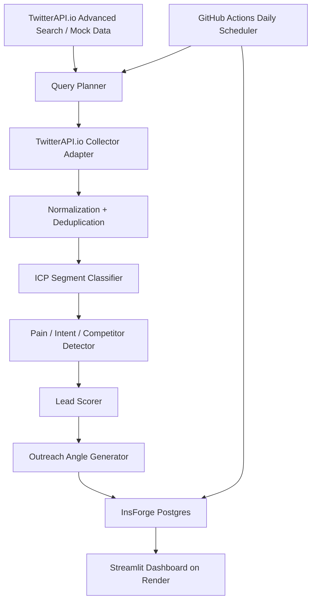

# Atlas Daily Lead Intelligence Dashboard

Atlas Daily Lead Intelligence Dashboard is a GTM intelligence dashboard for Atlas Cloud. It helps Atlas discover high-scale AI media customers from public Twitter/X posts and turns noisy social signals into prioritized, explainable GTM leads.

The final product is an executive-friendly Dashboard, not a raw data collection script. It is designed to help Jerry and the Atlas team quickly answer:

- Which potential customers are worth contacting today?
- Why are they a fit for Atlas?
- Are they using or complaining about fal.ai, Replicate, Runway, Kling, Seedance, Wan, Veo, or other media AI infrastructure?
- Do they show scale potential?
- Which outreach angle should Atlas use?

## Product Positioning

Atlas Cloud is positioned around four core messages:

- One API for all SOTA media AI models
- Best pricing package in the industry for clients with scale
- Reliable service for production workloads
- Better pricing vs fal.ai for creators and platforms

The Dashboard converts public Twitter/X posts into scored leads, evidence, reason codes, and suggested outreach angles. The goal is to help Atlas find first-wave customers who are already showing production pain around AI media generation, cost, reliability, model coverage, or scaling.

## First-Wave ICP

The stakeholder clarified that the first-wave ICP is:

1. Higgsfield-like AI-native creator platforms
2. Platforms with many creators
3. Digital marketing firms
4. iPhone/mobile AI media app teams
5. AI video generator apps
6. Short-form video/movie producers

Enterprise leads are explicitly excluded from the first wave because enterprise sales cycles are too long. The MVP prioritizes faster-moving creator platforms, mobile AI products, agencies, AI video tools, and short-form production teams that can evaluate and adopt infrastructure quickly.

## Architecture



## Technical Stack

- Python 3.11 for the agent pipeline
- Pydantic for structured schemas and validation
- SQLAlchemy for database access
- TwitterAPI.io as the production Twitter/X data provider
- Mock JSONL fallback for local demo and testing
- InsForge Postgres for persistent cloud storage
- Streamlit for the dashboard
- Render for dashboard deployment
- GitHub Actions for daily monitoring
- Optional OpenAI-compatible LLM endpoint for classification and outreach generation

## TwitterAPI.io Data Provider

Production collection uses the TwitterAPI.io provider adapter. The collector uses TwitterAPI.io documented API endpoints to retrieve public Twitter/X posts.

The production collector:

- Uses the TwitterAPI.io API key through the `X-API-Key` header
- Calls the documented Advanced Search endpoint
- Uses targeted queries around AI media platforms, fal.ai pain, AI video apps, creator platforms, digital marketing agencies, mobile AI apps, and short-form video producers
- Should support `since_time` and `until_time` query windows for daily monitoring
- Avoids unnecessary pagination and keeps each request bounded
- Implements retry/backoff and safe failure handling
- Never exposes the API key in logs, README screenshots, demo videos, or frontend code

The query planner generates search queries for the first-wave ICP and filters out enterprise-style opportunities where possible.

## Responsible Data Usage

This project is designed for public lead intelligence and responsible demo operation.

- Use TwitterAPI.io documented API endpoints only.
- No browser automation.
- No cookie scraping.
- No login scraping.
- No anti-bot or rate-limit bypass.
- No automated posting, liking, following, DMs, or write actions.
- No residential proxies.
- No collection of private or non-public data.
- Store only the public post metadata needed for lead scoring and evidence.
- Respect TwitterAPI.io usage limits, credit limits, and provider terms.
- Use mock data fallback for demos, tests, and offline development.
- Keep API keys and database URLs in environment variables, Render environment variables, or GitHub Secrets only.

## Scoring Methodology

Total score: 100

Breakdown:

- Scale potential: 30
- Atlas fit: 25
- Cost / reliability pain: 20
- Buying intent: 15
- Contactability: 10

Penalties:

- Enterprise lead penalty: -20
- Competitor official account penalty: -30
- Pure news penalty: -15
- Casual individual creator penalty: -10

Lead buckets:

- 85-100: Top Revenue Lead
- 70-84: Strong Lead
- 55-69: Watchlist
- 40-54: Distribution / KOL / Weak Lead
- 0-39: Not Qualified

Example reason codes:

- `HIGGSFIELD_LIKE_PLATFORM`
- `CREATOR_PLATFORM_SCALE`
- `IOS_AI_MEDIA_APP`
- `AI_VIDEO_GENERATOR_APP`
- `DIGITAL_MARKETING_AGENCY`
- `SHORT_FORM_VIDEO_PRODUCER`
- `FAL_PRICING_PAIN`
- `COMPETITOR_PAIN`
- `VIDEO_GEN_SCALE`
- `IMAGE_VIDEO_API_NEED`
- `ONE_API_NEED`
- `MODEL_COVERAGE_NEED`
- `RELIABILITY_PAIN`
- `QUEUE_LATENCY_PAIN`
- `PRODUCTION_WORKLOAD`
- `KOL_DISTRIBUTION`
- `ENTERPRISE_EXCLUDED`
- `PURE_NEWS`
- `COMPETITOR_OFFICIAL`

## Dashboard Sections

### 1. Overview

The Overview tab gives the Atlas team a daily operating snapshot:

- Daily posts scanned
- Qualified leads
- Top revenue leads
- Fal displacement leads
- iOS/mobile AI app leads
- Agency/marketing leads
- Creator platform leads
- Enterprise excluded

It also includes charts for segment distribution, lead bucket distribution, and competitor mentions.

### 2. Top Revenue Leads

Prioritized leads with score, segment, pain type, competitor mentions, source URL, and Atlas pitch angle.

### 3. Fal Displacement Leads

Leads mentioning fal.ai pricing, cost, latency, queue, reliability, or alternatives. This matters because Atlas can offer better pricing vs fal.ai for creators/platforms that are already showing production or scale pain.

### 4. Creator Platform Watchlist

Watchlist for:

- Higgsfield-like platforms
- AI creator platforms
- AI video apps
- Mobile AI media products
- Creator tools with scale potential

### 5. Distribution / KOL Leads

Tutorial authors, workflow authors, AI video creators, and people who may not buy directly but can influence creator adoption.

### 6. Query Performance

Shows which queries generated the most qualified leads, average score by query category, and segment distribution.

### 7. Competitor Mentions

Tracks mentions of:

- fal.ai
- Replicate
- Runway
- Pika
- Luma
- Kling
- Seedance
- Wan
- Veo
- Hailuo
- Vidu
- OpenRouter
- RunPod
- Modal
- Fireworks
- Together

### 8. Run Logs

Shows latest daily runs, collection status, posts collected, leads generated, and errors if any.

## Environment Variables

Create `.env` from `.env.example` for local development.

```bash
APP_ENV=development
USE_MOCK_DATA=true

INSFORGE_DATABASE_URL=
DATABASE_URL=

TWITTERAPI_IO_API_KEY=
TWITTERAPI_IO_BASE_URL=https://api.twitterapi.io

LLM_API_KEY=
LLM_BASE_URL=
LLM_MODEL=

ALERT_SCORE_THRESHOLD=75
```

Notes:

- `TWITTERAPI_IO_API_KEY` is required for production TwitterAPI.io collection.
- `USE_MOCK_DATA=true` allows the full pipeline and dashboard to run without external API calls.
- `INSFORGE_DATABASE_URL` is recommended for production persistence.
- Local SQLite via `DATABASE_URL` is only for development or mock demo mode.

## Local Setup

```bash
python -m venv .venv
source .venv/bin/activate
pip install -r requirements.txt
cp .env.example .env
python -m app.db.migrations
python -m app.main --mock --export
streamlit run app/dashboard/streamlit_app.py
```

On Windows PowerShell:

```powershell
.venv\Scripts\Activate.ps1
```

## Mock Run

Mock mode uses `data/sample_posts.jsonl`. It is designed for demos, tests, and offline development.

Mock mode produces the same output structure as production:

- `outputs/top_revenue_leads.csv`
- `outputs/fal_displacement_leads.csv`
- `outputs/creator_platform_watchlist.csv`
- `outputs/distribution_kol_leads.csv`
- `outputs/daily_report.md`

Command:

```bash
python -m app.main --mock --export
```

## Production Run

Production mode uses TwitterAPI.io. It requires `TWITTERAPI_IO_API_KEY`.

When `INSFORGE_DATABASE_URL` is set, results are written to InsForge Postgres. Production should not rely on local files for persistent storage.

Command:

```bash
python -m app.main --prod --export
```

## Deploying the Dashboard to Render

Render hosts the Streamlit dashboard. Persistent data should live in InsForge Postgres, not Render's local filesystem. The dashboard reads from InsForge Postgres and may fall back to CSV outputs in demo mode.

Render settings:

Build command:

```bash
pip install -r requirements.txt
```

Start command:

```bash
streamlit run app/dashboard/streamlit_app.py --server.port $PORT --server.address 0.0.0.0
```

Render environment variables:

```bash
APP_ENV=production
USE_MOCK_DATA=false
INSFORGE_DATABASE_URL=...
TWITTERAPI_IO_API_KEY=...
TWITTERAPI_IO_BASE_URL=https://api.twitterapi.io
LLM_API_KEY=...
LLM_BASE_URL=...
LLM_MODEL=...
```

The included `render.yaml` provides the Python web service blueprint for the dashboard.

## InsForge Postgres Setup

InsForge Postgres is used as the persistent backend. It stores:

- `runs`
- `raw_posts`
- `classified_posts`
- `leads`
- `feedback_labels`

This avoids relying on local disk or Render ephemeral storage. The application reads `INSFORGE_DATABASE_URL` from environment variables.

Initialize tables:

```bash
python -m app.db.migrations
```

## GitHub Actions Daily Monitoring

GitHub Actions runs the pipeline once per day and can also be triggered manually through `workflow_dispatch`.

Workflow file:

```text
.github/workflows/daily_monitor.yml
```

GitHub Secrets:

- `INSFORGE_DATABASE_URL`
- `TWITTERAPI_IO_API_KEY`
- `TWITTERAPI_IO_BASE_URL`
- `LLM_API_KEY`
- `LLM_BASE_URL`
- `LLM_MODEL`

Workflow behavior:

- Install dependencies
- Run `python -m app.main --prod --export`
- Write data into InsForge Postgres
- Upload CSV files and `daily_report.md` as workflow artifacts

## Outputs

- `outputs/top_revenue_leads.csv`: highest-priority revenue leads for immediate follow-up
- `outputs/fal_displacement_leads.csv`: fal.ai displacement leads and competitor-pain opportunities
- `outputs/creator_platform_watchlist.csv`: creator platforms, mobile AI apps, and AI video products worth monitoring
- `outputs/distribution_kol_leads.csv`: tutorial, workflow, and KOL opportunities that may influence creator adoption
- `outputs/daily_report.md`: executive-readable daily summary of top leads and signals

## Limitations

- TwitterAPI.io data availability and search behavior may vary.
- Query quality directly affects lead quality.
- Some posts may not provide enough company or contact information.
- LLM classification can make mistakes, so reason codes and evidence are shown for review.
- Production precision should be improved with human feedback from Atlas BD/founder review.
- The MVP does not perform automated outreach.
- The MVP does not use private data.
- The MVP does not guarantee conversion; it prioritizes leads for human follow-up.

## Two-Week Roadmap

### Week 1

- Tune queries based on Jerry/BD feedback
- Add human feedback labels for good/bad leads
- Improve precision@20
- Add company enrichment from public website/profile URLs
- Add better query performance analytics
- Add Slack or email alert for high-score leads

### Week 2

- Add CRM export
- Add lead history by username/company
- Add deduplication across days
- Add weekly GTM report
- Add model-based query expansion
- Add competitor-specific reports, especially fal.ai displacement
- Add dashboard authentication if needed
- Add more robust monitoring and error alerts
